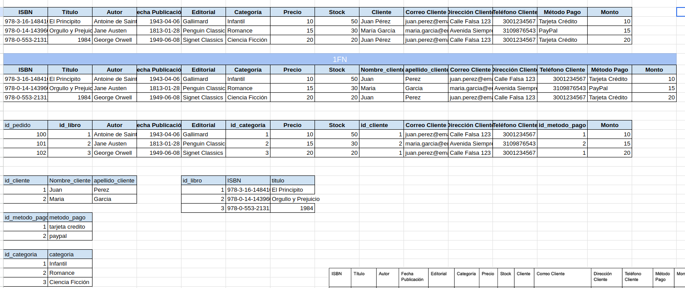
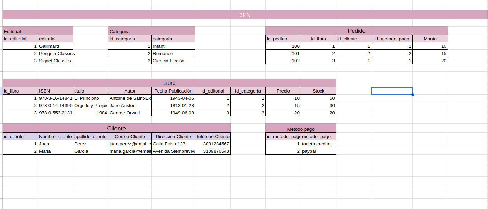
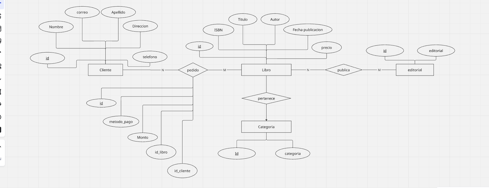

# Examen Introduccion al Backend

Este proyecto modela una base de datos para la gestión de libros, clientes y ventas.  
Incluye el proceso de normalización y los diagramas conceptual y lógico.

---

## Datos Iniciales

La tabla original contiene información de:
- Libros
- Clientes
- Pedidos

Todo se encontraba en una sola tabla, lo cual genera redundancia y problemas de actualización.

---

## Primera Forma Normal (1FN)

Se encuentra en 1FN porque:
- No hay grupos repetidos.
- Valores atomicos.
- Menos redundancia.

---

## Segunda Forma Normal (2FN)

Se encuentra en 2FN porque:
- Cumple 1FN.
- Los atributos no clave dependen completamente de la clave primaria.
- Separa en tablas independientes.

## Tercera Forma Normal (3FN)

Se encuentra en 3FN porque:
- Cumple 2FN.
- No existen dependencias transitivas.
- Cada atributo depende de su clave primaria.
- No hay redundancia de datos.

---

## Diagrama Entidad-Relación (E-R)

## Diagrama UML E-R

## Modelo Fisico (SQL)

Se encuentra en el archivo Libros.sq